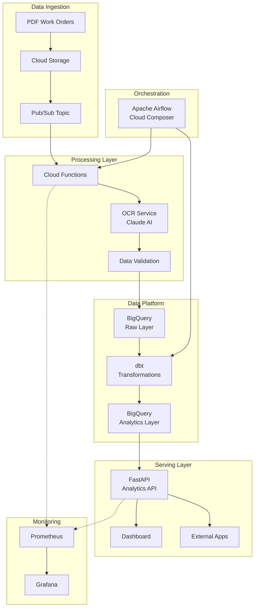

# Work Order Pipeline Architecture

## Overview

This document describes the modernized, cloud-native architecture for the Work Order Processing Pipeline. The system processes construction work orders from PDF documents, extracts structured data using AI, and provides analytics through a scalable data platform.

## Architecture Diagram



## Key Components

### 1. Data Ingestion Layer

**Google Cloud Storage (GCS)**
- Stores raw PDF work orders
- Lifecycle policies for automatic archival
- Versioning enabled for data recovery

**Cloud Pub/Sub**
- Event-driven architecture for real-time processing
- Decouples upload from processing
- Guaranteed message delivery with retry logic

### 2. Processing Layer

**OCR Service**
- Uses Claude 3.5 Sonnet for intelligent OCR
- Handles various work order formats
- Built-in error correction and validation
- Prometheus metrics for monitoring

**Data Quality Framework**
- Great Expectations for validation
- Custom quality scores for each extraction
- Automated data profiling

### 3. Data Platform

**BigQuery Data Warehouse**
- **Raw Layer**: Immutable, partitioned by extraction date
- **Staging Layer**: Light transformations, data type conversions
- **Analytics Layer**: Business-ready dimensional model
- Cost optimization through clustering and partitioning

**dbt (Data Build Tool)**
- Version-controlled SQL transformations
- Built-in testing and documentation
- Incremental processing for efficiency
- Lineage tracking

### 4. Orchestration

**Apache Airflow (Cloud Composer)**
- DAG-based workflow management
- Parallel processing capabilities
- SLA monitoring and alerting
- Integration with all GCP services

### 5. Serving Layer

**FastAPI Analytics API**
- RESTful endpoints for data access
- Built-in documentation (OpenAPI)
- Response caching for performance
- Rate limiting and authentication

### 6. Monitoring & Observability

**Metrics Stack**
- Prometheus for metrics collection
- Grafana for visualization
- Custom dashboards for pipeline health
- Alerting for anomalies

## Data Model

### Fact Table: `fct_work_orders`
```sql
- work_order_id (STRING, Primary Key)
- work_order_number (STRING)
- work_date (DATE, Partitioned)
- builder_key (STRING, Clustered)
- project_key (STRING, Clustered)
- company_key (STRING)
- service_type (STRING)
- quantity (FLOAT64)
- hours (FLOAT64)
- estimated_value (FLOAT64)
- data_quality_score (FLOAT64)
```

### Dimension Tables:
- `dim_builders`: Builder information with tier classification
- `dim_projects`: Project details and metrics
- `dim_companies`: Service company information
- `dim_dates`: Date dimension for time-based analysis

## Key Design Decisions

### 1. Event-Driven Architecture
- **Why**: Enables real-time processing and better scalability
- **Implementation**: Pub/Sub triggers Cloud Functions for immediate processing
- **Benefits**: Reduced latency, automatic scaling, cost efficiency

### 2. BigQuery over Traditional RDBMS
- **Why**: Native GCP integration, automatic scaling, cost-effective for analytics
- **Implementation**: Partitioned tables, materialized views for performance
- **Benefits**: No infrastructure management, pay-per-query pricing

### 3. dbt for Transformations
- **Why**: SQL-based transformations are maintainable and testable
- **Implementation**: Modular models, automated testing, documentation
- **Benefits**: Version control, CI/CD integration, data lineage

### 4. Microservices Approach
- **Why**: Independent scaling, technology flexibility
- **Implementation**: Separate services for OCR, API, processing
- **Benefits**: Fault isolation, easier updates, polyglot persistence

## Performance Optimizations

### 1. Caching Strategy
- API responses cached with Redis
- OCR results cached to avoid reprocessing
- BigQuery results cached for repeated queries

### 2. Parallel Processing
- Airflow parallel task execution
- Async API endpoints
- Batch processing for bulk operations

### 3. Data Partitioning
- BigQuery tables partitioned by date
- Clustered by frequently filtered columns
- Automatic table expiration for old data

## Security Considerations

### 1. Authentication & Authorization
- Service accounts with minimal permissions
- API key authentication for external access
- OAuth2 for user authentication

### 2. Data Encryption
- Encryption at rest in GCS and BigQuery
- TLS for data in transit
- Sensitive data masking in logs

### 3. Audit Trail
- All data modifications logged
- Access logs in Cloud Logging
- Data lineage tracked through dbt

## Deployment Strategy

### 1. Infrastructure as Code
- Terraform for all cloud resources
- Version controlled infrastructure
- Automated provisioning

### 2. CI/CD Pipeline
- GitHub Actions for automation
- Automated testing at every stage
- Blue-green deployments for zero downtime

### 3. Environment Management
- Separate dev, staging, production environments
- Environment-specific configurations
- Automated promotion between environments

## Cost Optimization

### 1. BigQuery
- Partitioning reduces query costs
- Clustering improves performance
- Scheduled queries for regular reports

### 2. Compute Resources
- Auto-scaling for variable workloads
- Spot instances for batch processing
- Resource quotas to prevent runaway costs

### 3. Storage
- Lifecycle policies for automatic archival
- Compression for historical data
- Regular cleanup of temporary files

## Monitoring & Alerting

### Key Metrics
- OCR success rate
- Processing latency (P50, P95, P99)
- Data quality scores
- Pipeline completion times
- API response times
- Error rates by component

### Alerts
- OCR accuracy below threshold
- Pipeline failures
- Unusual data volumes
- API latency spikes
- Budget threshold warnings

## Disaster Recovery

### Backup Strategy
- Daily BigQuery dataset snapshots
- GCS bucket replication
- Configuration backups in Git

### Recovery Procedures
- RPO: 1 hour
- RTO: 2 hours
- Automated failover for critical services
- Regular disaster recovery drills

## Future Enhancements

### 1. Machine Learning Integration
- Automated work order classification
- Anomaly detection for unusual patterns
- Predictive analytics for resource planning

### 2. Real-time Dashboard
- WebSocket connections for live updates
- Streaming analytics with Dataflow
- Mobile application support

### 3. Advanced OCR
- Multi-page document support
- Handwriting recognition improvements
- Support for additional document types

## Conclusion

This architecture provides a scalable, maintainable, and cost-effective solution for processing construction work orders. The modular design allows for easy enhancement and adaptation to changing business requirements while maintaining high performance and reliability.
